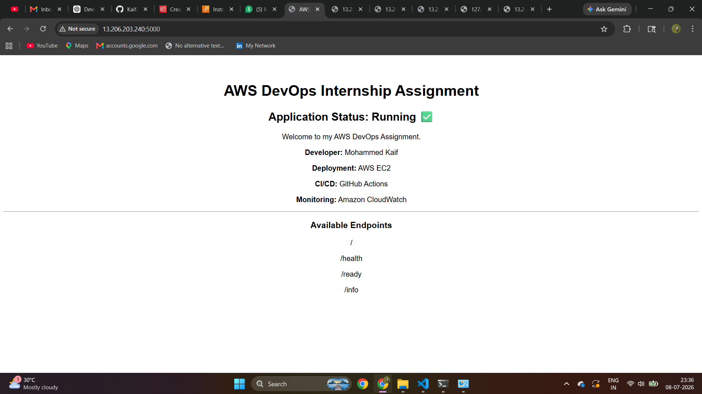
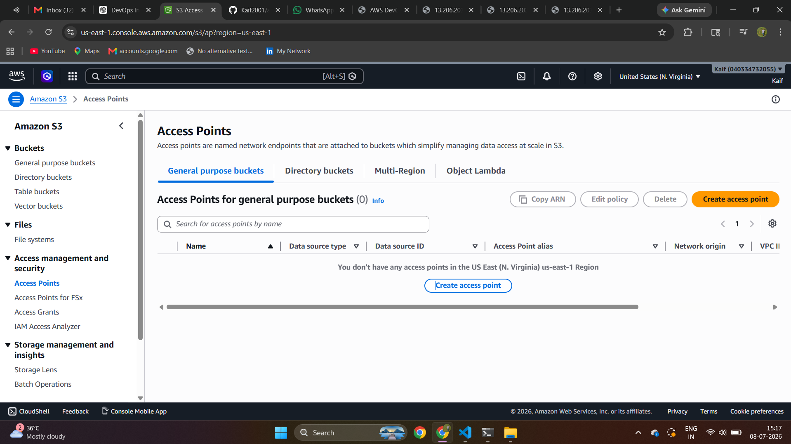
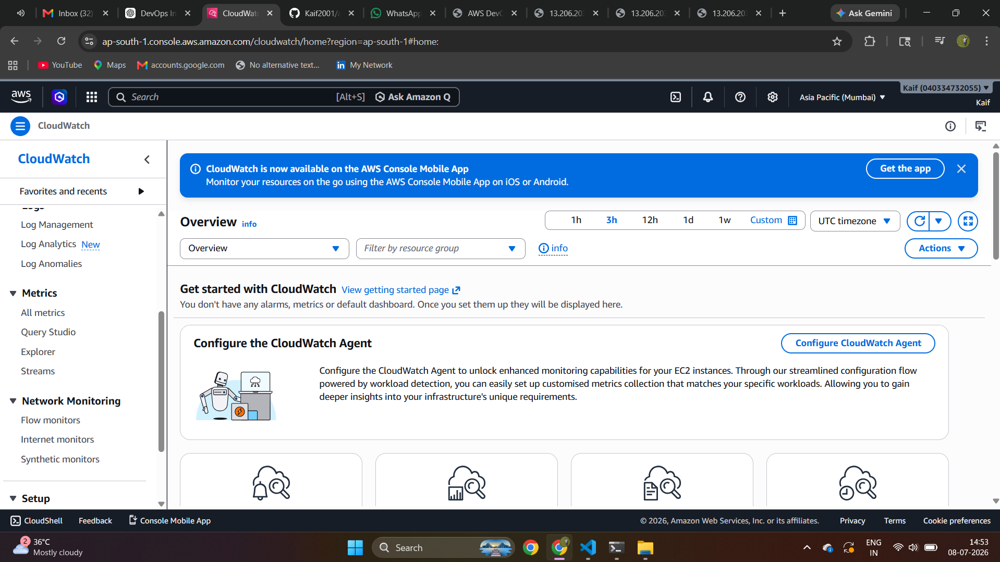
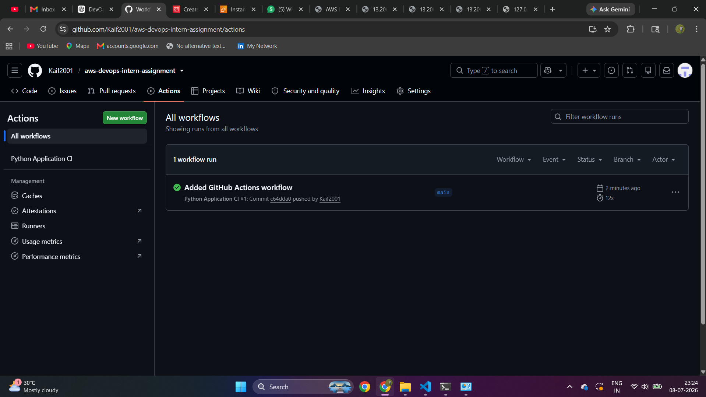

# AWS DevOps Internship Assignment

## Project Overview

This project demonstrates a production-style deployment of a Python Flask application on AWS using DevOps best practices.

---

# Technologies Used

- AWS EC2
- AWS S3
- AWS CloudWatch
- Terraform
- GitHub Actions
- Python Flask
- Git

---

# Project Structure

```
AWS-DevOps-Intern-Assignment/
│
├── app/
│   ├── app.py
│   └── requirements.txt
│
├── terraform/
│   ├── provider.tf
│   ├── variables.tf
│   ├── main.tf
│   └── outputs.tf
│
├── screenshots/
│   ├── application/
│   ├── cloudwatch/
│   ├── github-actions/
│   └── s3/
│
├── .github/
│   └── workflows/
│       └── python-app.yml
│
├── .gitignore
│
└── README.md
```

---

# Features

- Flask Web Application
- EC2 Deployment
- Health Endpoint
- Ready Endpoint
- Info Endpoint
- Amazon S3
- Amazon CloudWatch
- Terraform Infrastructure as Code
- GitHub Actions CI/CD

---

# Application URL

```
http://13.206.203.240:5000
```

---

# API Endpoints

## Home

```
/
```

Displays the application homepage.

---

## Health

```
/health
```

Returns

```json
{
    "status":"healthy",
    "application":"AWS DevOps Internship Assignment",
    "developer":"Mohammed Kaif"
}
```

---

## Ready

```
/ready
```

Returns

```json
{
    "status":"ready"
}
```

---

## Info

```
/info
```

Returns

```json
{
    "application":"AWS DevOps Internship Assignment",
    "developer":"Mohammed Kaif",
    "cloud":"AWS",
    "deployment":"EC2",
    "monitoring":"CloudWatch",
    "ci_cd":"GitHub Actions"
}
```

---

# AWS Services Used

## Amazon EC2

- Hosting Flask Application

---

## Amazon S3

- Object Storage
- Screenshot Storage

---

## Amazon CloudWatch

- CPU Monitoring
- Network Monitoring

---

# Terraform

Terraform configuration files are available inside

```
terraform/
```

Files included

- provider.tf
- variables.tf
- main.tf
- outputs.tf

---

# GitHub Actions

GitHub Actions automatically performs

- Checkout Repository
- Install Python
- Install Dependencies
- Python Syntax Check

---

# Screenshots

## Flask Application



---

## Amazon S3



---

## Amazon CloudWatch



---

## GitHub Actions



---

# Developer

**Mohammed Kaif**

AWS DevOps Internship Assignment